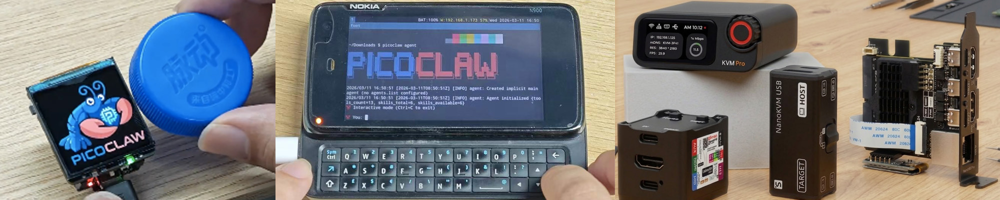

<div align="center">


<h1>PicoClaw: Assistente de IA Ultra-Eficiente em Go</h1>

<h3>Hardware de $10 · 10MB de RAM · Boot em ms · Let's Go, PicoClaw!</h3>
  <p>
    
    
    
    <br>
    <a href="https://picoclaw.io"></a>
    <a href="https://docs.picoclaw.io/"></a>
    <a href="https://deepwiki.com/sipeed/picoclaw"></a>
    <br>
    <a href="https://x.com/SipeedIO"></a>
    <a href="./assets/wechat.png"></a>
    <a href="https://discord.gg/V4sAZ9XWpN"></a>
  </p>

[中文](README.zh.md) | [日本語](README.ja.md) | **Português** | [Tiếng Việt](README.vi.md) | [Français](README.fr.md) | [Italiano](README.it.md) | [Bahasa Indonesia](README.id.md) | [English](README.md)

</div>

---

> **PicoClaw** é um projeto open-source independente iniciado pela [Sipeed](https://sipeed.com), escrito inteiramente em **Go** do zero — não é um fork do OpenClaw, NanoBot ou qualquer outro projeto.

**PicoClaw** é um assistente de IA pessoal ultra-leve inspirado no [NanoBot](https://github.com/HKUDS/nanobot). Foi reconstruído do zero em **Go** por meio de um processo de "auto-bootstrapping" — o próprio AI Agent conduziu a migração de arquitetura e a otimização do código.

**Roda em hardware de $10 com menos de 10MB de RAM** — isso é 99% menos memória que o OpenClaw e 98% mais barato que um Mac mini!

<table align="center">
<tr align="center">
<td align="center" valign="top">
<p align="center">

</p>
</td>
<td align="center" valign="top">
<p align="center">

</p>
</td>
</tr>
</table>

> [!CAUTION]
> **Aviso de Segurança**
>
> * **SEM CRIPTO:** O PicoClaw **não** emitiu nenhum token oficial ou criptomoeda. Todas as alegações no `pump.fun` ou outras plataformas de negociação são **golpes**.
> * **DOMÍNIO OFICIAL:** O **ÚNICO** site oficial é **[picoclaw.io](https://picoclaw.io)**, e o site da empresa é **[sipeed.com](https://sipeed.com)**
> * **ATENÇÃO:** Muitos domínios `.ai/.org/.com/.net/...` foram registrados por terceiros. Não confie neles.
> * **NOTA:** O PicoClaw está em desenvolvimento rápido inicial. Podem existir problemas de segurança não resolvidos. Não implante em produção antes da v1.0.
> * **NOTA:** O PicoClaw mesclou muitos PRs recentemente. Builds recentes podem usar 10-20MB de RAM. A otimização de recursos está planejada após a estabilização de funcionalidades.

## 📢 Novidades

2026-03-17 🚀 **v0.2.3 Lançada!** UI na bandeja do sistema (Windows e Linux), consulta de status de sub-agent (`spawn_status`), hot-reload experimental do Gateway, controle de segurança do Cron e 2 correções de segurança. O PicoClaw atingiu **25K Stars**!

2026-03-09 🎉 **v0.2.1 — Maior atualização até agora!** Suporte ao protocolo MCP, 4 novos channels (Matrix/IRC/WeCom/Discord Proxy), 3 novos providers (Kimi/Minimax/Avian), pipeline de visão, armazenamento de memória JSONL, roteamento de modelos.

2026-02-28 📦 **v0.2.0** lançada com suporte a Docker Compose e Web UI Launcher.

2026-02-26 🎉 O PicoClaw atinge **20K Stars** em apenas 17 dias! Orquestração automática de channels e interfaces de capacidade estão disponíveis.

<details>
<summary>Notícias anteriores...</summary>

2026-02-16 🎉 O PicoClaw ultrapassa 12K Stars em uma semana! Funções de mantenedor da comunidade e [Roadmap](ROADMAP.md) lançados oficialmente.

2026-02-13 🎉 O PicoClaw ultrapassa 5000 Stars em 4 dias! Roadmap do projeto e grupos de desenvolvedores em andamento.

2026-02-09 🎉 **PicoClaw Lançado!** Construído em 1 dia para levar AI Agents a hardware de $10 com menos de 10MB de RAM. Let's Go, PicoClaw!

</details>

## ✨ Funcionalidades

🪶 **Ultra-leve**: Footprint de memória do núcleo <10MB — 99% menor que o OpenClaw.*

💰 **Custo mínimo**: Eficiente o suficiente para rodar em hardware de $10 — 98% mais barato que um Mac mini.

⚡️ **Boot ultrarrápido**: Inicialização 400x mais rápida. Boot em menos de 1s mesmo em um processador single-core de 0,6GHz.

🌍 **Verdadeiramente portátil**: Binário único para arquiteturas RISC-V, ARM, MIPS e x86. Um binário, roda em qualquer lugar!

🤖 **Bootstrapped por IA**: Implementação nativa pura em Go — 95% do código principal foi gerado por um Agent e refinado por revisão humana.

🔌 **Suporte a MCP**: Integração nativa com o [Model Context Protocol](https://modelcontextprotocol.io/) — conecte qualquer servidor MCP para estender as capacidades do Agent.

👁️ **Pipeline de visão**: Envie imagens e arquivos diretamente ao Agent — codificação base64 automática para LLMs multimodais.

🧠 **Roteamento inteligente**: Roteamento de modelos baseado em regras — consultas simples vão para modelos leves, economizando custos de API.

_*Builds recentes podem usar 10-20MB devido a merges rápidos de PRs. Otimização de recursos está planejada. Comparação de velocidade de boot baseada em benchmarks de single-core a 0,8GHz (veja tabela abaixo)._

<div align="center">

|                                | OpenClaw      | NanoBot                  | **PicoClaw**                           |
| ------------------------------ | ------------- | ------------------------ | -------------------------------------- |
| **Linguagem**                  | TypeScript    | Python                   | **Go**                                 |
| **RAM**                        | >1GB          | >100MB                   | **< 10MB***                            |
| **Tempo de boot**</br>(core 0,8GHz) | >500s    | >30s                     | **<1s**                                |
| **Custo**                      | Mac Mini $599 | Maioria das placas Linux ~$50 | **Qualquer placa Linux**</br>**a partir de $10** |


</div>

> **[Lista de Compatibilidade de Hardware](docs/pt-br/hardware-compatibility.md)** — Veja todas as placas testadas, de RISC-V de $5 ao Raspberry Pi e celulares Android. Sua placa não está listada? Envie um PR!

<p align="center">

</p>

## 🦾 Demonstração

### 🛠️ Fluxos de Trabalho Padrão do Assistente

<table align="center">
<tr align="center">
<th><p align="center">Modo Engenheiro Full-Stack</p></th>
<th><p align="center">Registro e Planejamento</p></th>
<th><p align="center">Busca na Web e Aprendizado</p></th>
</tr>
<tr>
<td align="center"><p align="center"></p></td>
<td align="center"><p align="center"></p></td>
<td align="center"><p align="center"></p></td>
</tr>
<tr>
<td align="center">Desenvolver · Implantar · Escalar</td>
<td align="center">Agendar · Automatizar · Lembrar</td>
<td align="center">Descobrir · Insights · Tendências</td>
</tr>
</table>

### 🐜 Implantação Inovadora de Baixo Consumo

O PicoClaw pode ser implantado em praticamente qualquer dispositivo Linux!

- $9,9 [LicheeRV-Nano](https://www.aliexpress.com/item/1005006519668532.html) edição E(Ethernet) ou W(WiFi6), para um assistente doméstico mínimo
- $30~50 [NanoKVM](https://www.aliexpress.com/item/1005007369816019.html), ou $100 [NanoKVM-Pro](https://www.aliexpress.com/item/1005010048471263.html), para operações automatizadas de servidor
- $50 [MaixCAM](https://www.aliexpress.com/item/1005008053333693.html) ou $100 [MaixCAM2](https://www.kickstarter.com/projects/zepan/maixcam2-build-your-next-gen-4k-ai-camera), para vigilância inteligente

<https://private-user-images.githubusercontent.com/83055338/547056448-e7b031ff-d6f5-4468-bcca-5726b6fecb5c.mp4>

🌟 Mais Casos de Implantação Aguardam!

## 📦 Instalação

### Download pelo picoclaw.io (Recomendado)

Acesse **[picoclaw.io](https://picoclaw.io)** — o site oficial detecta automaticamente sua plataforma e fornece download com um clique. Não é necessário selecionar a arquitetura manualmente.

### Download do binário pré-compilado

Alternativamente, baixe o binário para sua plataforma na página de [GitHub Releases](https://github.com/sipeed/picoclaw/releases).

### Compilar a partir do código-fonte (para desenvolvimento)

```bash
git clone https://github.com/sipeed/picoclaw.git

cd picoclaw
make deps

# Compilar o binário principal
make build

# Compilar o Web UI Launcher (necessário para o modo WebUI)
make build-launcher

# Compilar para múltiplas plataformas
make build-all

# Compilar para Raspberry Pi Zero 2 W (32-bit: make build-linux-arm; 64-bit: make build-linux-arm64)
make build-pi-zero

# Compilar e instalar
make install
```

**Raspberry Pi Zero 2 W:** Use o binário que corresponde ao seu SO: Raspberry Pi OS 32-bit -> `make build-linux-arm`; 64-bit -> `make build-linux-arm64`. Ou execute `make build-pi-zero` para compilar ambos.

## 🚀 Guia de Início Rápido

### 🌐 WebUI Launcher (Recomendado para Desktop)

O WebUI Launcher fornece uma interface baseada em navegador para configuração e chat. Esta é a maneira mais fácil de começar — sem necessidade de conhecimento de linha de comando.

**Opção 1: Duplo clique (Desktop)**

Após baixar de [picoclaw.io](https://picoclaw.io), dê duplo clique em `picoclaw-launcher` (ou `picoclaw-launcher.exe` no Windows). Seu navegador abrirá automaticamente em `http://localhost:18800`.

**Opção 2: Linha de comando**

```bash
picoclaw-launcher
# Abra http://localhost:18800 no seu navegador
```

> [!TIP]
> **Acesso remoto / Docker / VM:** Adicione a flag `-public` para escutar em todas as interfaces:
> ```bash
> picoclaw-launcher -public
> ```

<p align="center">

</p>

**Primeiros passos:**

Abra o WebUI e então: **1)** Configure um Provider (adicione sua API key de LLM) -> **2)** Configure um Channel (ex.: Telegram) -> **3)** Inicie o Gateway -> **4)** Converse!

Para documentação detalhada do WebUI, veja [docs.picoclaw.io](https://docs.picoclaw.io).

<details>
<summary><b>Docker (alternativa)</b></summary>

```bash
# 1. Clone este repositório
git clone https://github.com/sipeed/picoclaw.git
cd picoclaw

# 2. Primeira execução — gera automaticamente docker/data/config.json e encerra
#    (só é acionado quando config.json e workspace/ estão ausentes)
docker compose -f docker/docker-compose.yml --profile launcher up
# O container imprime "First-run setup complete." e para.

# 3. Configure suas API keys
vim docker/data/config.json

# 4. Iniciar
docker compose -f docker/docker-compose.yml --profile launcher up -d
# Abra http://localhost:18800
```

> **Usuários de Docker / VM:** O Gateway escuta em `127.0.0.1` por padrão. Defina `PICOCLAW_GATEWAY_HOST=0.0.0.0` ou use a flag `-public` para torná-lo acessível pelo host.

```bash
# Verificar logs
docker compose -f docker/docker-compose.yml logs -f

# Parar
docker compose -f docker/docker-compose.yml --profile launcher down

# Atualizar
docker compose -f docker/docker-compose.yml pull
docker compose -f docker/docker-compose.yml --profile launcher up -d
```

</details>

### 💻 TUI Launcher (Recomendado para Headless / SSH)

O TUI (Terminal UI) Launcher fornece uma interface de terminal completa para configuração e gerenciamento. Ideal para servidores, Raspberry Pi e outros ambientes headless.

```bash
picoclaw-launcher-tui
```

<p align="center">

</p>

**Primeiros passos:**

Use os menus do TUI para: **1)** Configurar um Provider -> **2)** Configurar um Channel -> **3)** Iniciar o Gateway -> **4)** Conversar!

Para documentação detalhada do TUI, veja [docs.picoclaw.io](https://docs.picoclaw.io).

### 📱 Android

Dê uma segunda vida ao seu celular de uma década! Transforme-o em um Assistente de IA inteligente com o PicoClaw.

**Opção 1: Termux (disponível agora)**

1. Instale o [Termux](https://github.com/termux/termux-app) (baixe nas [GitHub Releases](https://github.com/termux/termux-app/releases), ou pesquise no F-Droid / Google Play)
2. Execute os seguintes comandos:

```bash
# Baixar a versão mais recente
wget https://github.com/sipeed/picoclaw/releases/latest/download/picoclaw_Linux_arm64.tar.gz
tar xzf picoclaw_Linux_arm64.tar.gz
pkg install proot
termux-chroot ./picoclaw onboard   # chroot fornece um layout padrão de sistema de arquivos Linux
```

Em seguida, siga a seção Terminal Launcher abaixo para concluir a configuração.


**Opção 2: Instalação via APK (em breve)**

Um APK Android independente com WebUI integrado está em desenvolvimento. Fique ligado!

<details>
<summary><b>Terminal Launcher (para ambientes com recursos limitados)</b></summary>

Para ambientes mínimos onde apenas o binário principal `picoclaw` está disponível (sem Launcher UI), você pode configurar tudo via linha de comando e um arquivo de configuração JSON.

**1. Inicializar**

```bash
picoclaw onboard
```

Isso cria `~/.picoclaw/config.json` e o diretório workspace.

**2. Configurar** (`~/.picoclaw/config.json`)

```json
{
  "agents": {
    "defaults": {
      "model_name": "gpt-5.4"
    }
  },
  "model_list": [
    {
      "model_name": "gpt-5.4",
      "model": "openai/gpt-5.4",
      "api_key": "sk-your-api-key"
    }
  ]
}
```

> Veja `config/config.example.json` no repositório para um template de configuração completo com todas as opções disponíveis.

**3. Conversar**

```bash
# Pergunta única
picoclaw agent -m "What is 2+2?"

# Modo interativo
picoclaw agent

# Iniciar gateway para integração com app de chat
picoclaw gateway
```

</details>

## 🔌 Providers (LLM)

O PicoClaw suporta mais de 30 providers de LLM através da configuração `model_list`. Use o formato `protocolo/modelo`:

| Provider | Protocolo | API Key | Notas |
|----------|-----------|---------|-------|
| [OpenAI](https://platform.openai.com/api-keys) | `openai/` | Obrigatória | GPT-5.4, GPT-4o, o3, etc. |
| [Anthropic](https://console.anthropic.com/settings/keys) | `anthropic/` | Obrigatória | Claude Opus 4.6, Sonnet 4.6, etc. |
| [Google Gemini](https://aistudio.google.com/apikey) | `gemini/` | Obrigatória | Gemini 3 Flash, 2.5 Pro, etc. |
| [OpenRouter](https://openrouter.ai/keys) | `openrouter/` | Obrigatória | 200+ modelos, API unificada |
| [Zhipu (GLM)](https://open.bigmodel.cn/usercenter/proj-mgmt/apikeys) | `zhipu/` | Obrigatória | GLM-4.7, GLM-5, etc. |
| [DeepSeek](https://platform.deepseek.com/api_keys) | `deepseek/` | Obrigatória | DeepSeek-V3, DeepSeek-R1 |
| [Volcengine](https://console.volcengine.com) | `volcengine/` | Obrigatória | Modelos Doubao, Ark |
| [Qwen](https://dashscope.console.aliyun.com/apiKey) | `qwen/` | Obrigatória | Qwen3, Qwen-Max, etc. |
| [Groq](https://console.groq.com/keys) | `groq/` | Obrigatória | Inferência rápida (Llama, Mixtral) |
| [Moonshot (Kimi)](https://platform.moonshot.cn/console/api-keys) | `moonshot/` | Obrigatória | Modelos Kimi |
| [Minimax](https://platform.minimaxi.com/user-center/basic-information/interface-key) | `minimax/` | Obrigatória | Modelos MiniMax |
| [Mistral](https://console.mistral.ai/api-keys) | `mistral/` | Obrigatória | Mistral Large, Codestral |
| [NVIDIA NIM](https://build.nvidia.com/) | `nvidia/` | Obrigatória | Modelos hospedados pela NVIDIA |
| [Cerebras](https://cloud.cerebras.ai/) | `cerebras/` | Obrigatória | Inferência rápida |
| [Novita AI](https://novita.ai/) | `novita/` | Obrigatória | Vários modelos abertos |
| [Ollama](https://ollama.com/) | `ollama/` | Não necessária | Modelos locais, self-hosted |
| [vLLM](https://docs.vllm.ai/) | `vllm/` | Não necessária | Implantação local, compatível com OpenAI |
| [LiteLLM](https://docs.litellm.ai/) | `litellm/` | Varia | Proxy para 100+ providers |
| [Azure OpenAI](https://portal.azure.com/) | `azure/` | Obrigatória | Implantação Azure Enterprise |
| [GitHub Copilot](https://github.com/features/copilot) | `github-copilot/` | OAuth | Login por código de dispositivo |
| [Antigravity](https://console.cloud.google.com/) | `antigravity/` | OAuth | Google Cloud AI |

<details>
<summary><b>Implantação local (Ollama, vLLM, etc.)</b></summary>

**Ollama:**
```json
{
  "model_list": [
    {
      "model_name": "local-llama",
      "model": "ollama/llama3.1:8b",
      "api_base": "http://localhost:11434/v1"
    }
  ]
}
```

**vLLM:**
```json
{
  "model_list": [
    {
      "model_name": "local-vllm",
      "model": "vllm/your-model",
      "api_base": "http://localhost:8000/v1"
    }
  ]
}
```

Para detalhes completos de configuração de providers, veja [Providers & Models](docs/pt-br/providers.md).

</details>

## 💬 Channels (Apps de Chat)

Converse com seu PicoClaw por meio de mais de 17 plataformas de mensagens:

| Channel | Configuração | Protocolo | Docs |
|---------|--------------|-----------|------|
| **Telegram** | Fácil (bot token) | Long polling | [Guia](docs/channels/telegram/README.pt-br.md) |
| **Discord** | Fácil (bot token + intents) | WebSocket | [Guia](docs/channels/discord/README.pt-br.md) |
| **WhatsApp** | Fácil (QR scan ou bridge URL) | Nativo / Bridge | [Guia](docs/pt-br/chat-apps.md#whatsapp) |
| **Weixin** | Fácil (scan QR nativo) | iLink API | [Guia](docs/pt-br/chat-apps.md#weixin) |
| **QQ** | Fácil (AppID + AppSecret) | WebSocket | [Guia](docs/channels/qq/README.pt-br.md) |
| **Slack** | Fácil (bot + app token) | Socket Mode | [Guia](docs/channels/slack/README.pt-br.md) |
| **Matrix** | Médio (homeserver + token) | Sync API | [Guia](docs/channels/matrix/README.pt-br.md) |
| **DingTalk** | Médio (credenciais do cliente) | Stream | [Guia](docs/channels/dingtalk/README.pt-br.md) |
| **Feishu / Lark** | Médio (App ID + Secret) | WebSocket/SDK | [Guia](docs/channels/feishu/README.pt-br.md) |
| **LINE** | Médio (credenciais + webhook) | Webhook | [Guia](docs/channels/line/README.pt-br.md) |
| **WeCom Bot** | Médio (webhook URL) | Webhook | [Guia](docs/channels/wecom/wecom_bot/README.pt-br.md) |
| **WeCom App** | Médio (credenciais corporativas) | Webhook | [Guia](docs/channels/wecom/wecom_app/README.pt-br.md) |
| **WeCom AI Bot** | Médio (token + chave AES) | WebSocket / Webhook | [Guia](docs/channels/wecom/wecom_aibot/README.pt-br.md) |
| **IRC** | Médio (servidor + nick) | Protocolo IRC | [Guia](docs/pt-br/chat-apps.md#irc) |
| **OneBot** | Médio (WebSocket URL) | OneBot v11 | [Guia](docs/channels/onebot/README.pt-br.md) |
| **MaixCam** | Fácil (habilitar) | TCP socket | [Guia](docs/channels/maixcam/README.pt-br.md) |
| **Pico** | Fácil (habilitar) | Protocolo nativo | Integrado |
| **Pico Client** | Fácil (WebSocket URL) | WebSocket | Integrado |

> Todos os channels baseados em webhook compartilham um único servidor HTTP do Gateway (`gateway.host`:`gateway.port`, padrão `127.0.0.1:18790`). O Feishu usa modo WebSocket/SDK e não utiliza o servidor HTTP compartilhado.

Para instruções detalhadas de configuração de channels, veja [Configuração de Apps de Chat](docs/pt-br/chat-apps.md).

## 🔧 Ferramentas

### 🔍 Busca na Web

O PicoClaw pode pesquisar na web para fornecer informações atualizadas. Configure em `tools.web`:

| Motor de Busca | API Key | Nível Gratuito | Link |
|----------------|---------|----------------|------|
| DuckDuckGo | Não necessária | Ilimitado | Fallback integrado |
| [Baidu Search](https://cloud.baidu.com/doc/qianfan-api/s/Wmbq4z7e5) | Obrigatória | 1000 consultas/dia | IA, otimizado para chinês |
| [Tavily](https://tavily.com) | Obrigatória | 1000 consultas/mês | Otimizado para AI Agents |
| [Brave Search](https://brave.com/search/api) | Obrigatória | 2000 consultas/mês | Rápido e privado |
| [Perplexity](https://www.perplexity.ai) | Obrigatória | Pago | Busca com IA |
| [SearXNG](https://github.com/searxng/searxng) | Não necessária | Self-hosted | Metabuscador gratuito |
| [GLM Search](https://open.bigmodel.cn/) | Obrigatória | Varia | Busca web Zhipu |

### ⚙️ Outras Ferramentas

O PicoClaw inclui ferramentas integradas para operações de arquivo, execução de código, agendamento e mais. Veja [Configuração de Ferramentas](docs/pt-br/tools_configuration.md) para detalhes.

## 🎯 Skills

Skills são capacidades modulares que estendem seu Agent. Elas são carregadas a partir de arquivos `SKILL.md` no seu workspace.

**Instalar skills do ClawHub:**

```bash
picoclaw skills search "web scraping"
picoclaw skills install <skill-name>
```

**Configurar token do ClawHub** (opcional, para limites de taxa mais altos):

Adicione ao seu `config.json`:
```json
{
  "tools": {
    "skills": {
      "registries": {
        "clawhub": {
          "auth_token": "your-clawhub-token"
        }
      }
    }
  }
}
```

Para mais detalhes, veja [Configuração de Ferramentas - Skills](docs/pt-br/tools_configuration.md#skills-tool).

## 🔗 MCP (Model Context Protocol)

O PicoClaw suporta nativamente o [MCP](https://modelcontextprotocol.io/) — conecte qualquer servidor MCP para estender as capacidades do seu Agent com ferramentas externas e fontes de dados.

```json
{
  "tools": {
    "mcp": {
      "enabled": true,
      "servers": {
        "filesystem": {
          "enabled": true,
          "command": "npx",
          "args": ["-y", "@modelcontextprotocol/server-filesystem", "/tmp"]
        }
      }
    }
  }
}
```

Para configuração completa de MCP (transportes stdio, SSE, HTTP, Tool Discovery), veja [Configuração de Ferramentas - MCP](docs/pt-br/tools_configuration.md#mcp-tool).

##  Junte-se à Rede Social de Agents

Conecte o PicoClaw à Rede Social de Agents simplesmente enviando uma única mensagem via CLI ou qualquer App de Chat integrado.

**Leia `https://clawdchat.ai/skill.md` e siga as instruções para entrar no [ClawdChat.ai](https://clawdchat.ai)**

## 🖥️ Referência CLI

| Comando                   | Descrição                              |
| ------------------------- | -------------------------------------- |
| `picoclaw onboard`        | Inicializar config e workspace         |
| `picoclaw auth weixin` | Conectar conta WeChat via QR |
| `picoclaw agent -m "..."` | Conversar com o agent                  |
| `picoclaw agent`          | Modo de chat interativo                |
| `picoclaw gateway`        | Iniciar o gateway                      |
| `picoclaw status`         | Exibir status                          |
| `picoclaw version`        | Exibir informações de versão           |
| `picoclaw model`          | Ver ou trocar o modelo padrão          |
| `picoclaw cron list`      | Listar todos os jobs agendados         |
| `picoclaw cron add ...`   | Adicionar um job agendado              |
| `picoclaw cron disable`   | Desabilitar um job agendado            |
| `picoclaw cron remove`    | Remover um job agendado                |
| `picoclaw skills list`    | Listar skills instaladas               |
| `picoclaw skills install` | Instalar uma skill                     |
| `picoclaw migrate`        | Migrar dados de versões anteriores     |
| `picoclaw auth login`     | Autenticar com providers               |

### ⏰ Tarefas Agendadas / Lembretes

O PicoClaw suporta lembretes agendados e tarefas recorrentes através da ferramenta `cron`:

* **Lembretes únicos**: "Lembre-me em 10 minutos" -> dispara uma vez após 10min
* **Tarefas recorrentes**: "Lembre-me a cada 2 horas" -> dispara a cada 2 horas
* **Expressões cron**: "Lembre-me às 9h diariamente" -> usa expressão cron

## 📚 Documentação

Para guias detalhados além deste README:

| Tópico | Descrição |
|--------|-----------|
| [Docker & Início Rápido](docs/pt-br/docker.md) | Configuração do Docker Compose, modos Launcher/Agent |
| [Apps de Chat](docs/pt-br/chat-apps.md) | Guias de configuração para todos os 17+ channels |
| [Configuração](docs/pt-br/configuration.md) | Variáveis de ambiente, layout do workspace, sandbox de segurança |
| [Providers & Models](docs/pt-br/providers.md) | 30+ providers de LLM, roteamento de modelos, configuração de model_list |
| [Spawn & Tarefas Assíncronas](docs/pt-br/spawn-tasks.md) | Tarefas rápidas, tarefas longas com spawn, orquestração assíncrona de sub-agents |
| [Hooks](docs/hooks/README.md) | Sistema de hooks orientado a eventos: observadores, interceptores, hooks de aprovação |
| [Steering](docs/steering.md) | Injetar mensagens em um loop de agente em execução |
| [SubTurn](docs/subturn.md) | Coordenação de subagentes, controle de concorrência, ciclo de vida |
| [Solução de Problemas](docs/pt-br/troubleshooting.md) | Problemas comuns e soluções |
| [Configuração de Ferramentas](docs/pt-br/tools_configuration.md) | Habilitar/desabilitar por ferramenta, políticas de exec, MCP, Skills |
| [Compatibilidade de Hardware](docs/pt-br/hardware-compatibility.md) | Placas testadas, requisitos mínimos |

## 🤝 Contribuir & Roadmap

PRs são bem-vindos! O código-fonte é intencionalmente pequeno e legível.

Veja nosso [Roadmap da Comunidade](https://github.com/sipeed/picoclaw/issues/988) e [CONTRIBUTING.md](CONTRIBUTING.md) para diretrizes.

Grupo de desenvolvedores em formação, entre após seu primeiro PR mesclado!

Grupos de Usuários:

Discord: <https://discord.gg/V4sAZ9XWpN>

WeChat:

